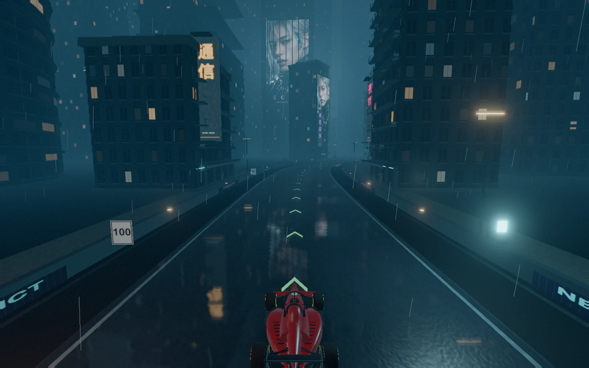

# GridPunk

A racing game with three stages: **Cyberpunk**, **Solarpunk**, and **Steampunk**. Each stage contains **Neon District** (3.744 km, 12 corners) and **Kairo Loop** (5.807 km, 18 corners). Three laps, six cars, and independent lap records for all six stage/circuit combinations.

[Play GridPunk](https://gridpunk.smallweblab.com/) · [GitHub repository](https://github.com/RamonLinares/GridPunk)



## Play

[Open GridPunk in your browser](https://gridpunk.smallweblab.com/), choose a stage and circuit, then press **Load race**. The game code and world assets load after that choice. Pick your car on the race screen and press **Start race**. Direct `?circuit=` links still open their chosen race immediately.

## What's included

- A lightweight opening screen for Cyberpunk, Solarpunk and Steampunk, each with two circuit choices. Switching stage retains the selected layout. The race screen also lets you change stage, circuit and car. Existing circuit links and records remain compatible.
- Neon Solar and Neon Steam: the original District centreline, banked turns and tunnel ported into garden-city and foundry-city scenery. The themed underpasses retain 7.2 m clearance. Open `?stage=solarpunk&circuit=neon` or `?stage=steampunk&circuit=neon`. See [stage and circuit notes](docs/stages.md).

- Kairo Loop: An 18-corner layout adapted to the city, including a grade-separated figure-eight flyover and a giant animated Ferris wheel with pink rim lights, ramen and bonsai holograms, and a Mars video billboard. Open directly with `?circuit=kairo`.
- Kairo Solar: the Kairo layout in daylight. Terraced blocks draped in vines and living walls, rooftop solar arrays, hedges, flower beds and big street trees along the whole loop, grandstands, glass garden towers, solar farms, wind turbines against mountains and a bay, cumulus skies and cascaded sun shadows. Open directly with `?circuit=solar`.
- Kairo Steam: the exact Kairo layout through brick factories, copper pipe gantries, gas lanterns, turning flywheels, the Clockworks tower, Boiler Works and Royal Kairo Aerodrome. Cargo dirigibles and rooftop steam animate the sunset skyline. Select it in the circuit menu or open `?circuit=steam`. See [the circuit notes](docs/kairo-steam.md).
- Solar landmarks: Helios Grove's branching solar collectors, The Glasshouse's botanical conservatory, and Harvest Commons' vertical farm and market, with rainwater tanks, growing beds and public plazas.
- Shinsei ND-01 and Kurogane K89-R, with a mixed grid of five AI rivals.
- Neon city, skyways, elevated/banked road sections, tunnel, wet surfaces, animated signs, flying traffic and video holograms.
- Rain, engine and spatial hologram audio.
- Fixed Rookie driver assists, independent rival difficulty, automatic/performance/quality/extreme/cinematic graphics.
- Keyboard, gamepad and touch controls, multiple cameras, recovery, pause and restart.
- Lap/sector timing, personal bests and lap replay/export.
- Original Blender models, car source and asset build scripts.

## Controls

| Action | Keyboard |
| --- | --- |
| Accelerate / steer | W / A / D or arrow keys |
| Brake | Space or S / Down |
| Reverse at rest | S / Down |
| Camera | C |
| Recover to track | R |
| Pause / resume | Escape |

Gamepad: left stick and triggers; Start pauses, X changes camera, Y recovers. Touch buttons appear on touch devices.

## Development

To run the game locally, install Node.js 22.12+ and npm, then run these commands from the project folder:

```sh
npm ci
npm run dev
```

Open the local address printed in the terminal.

### Build and test

```sh
npm run build       # TypeScript + production bundle in dist/
npm run preview     # http://127.0.0.1:4198/
npm test            # Builds and tests production in Chrome, desktop + touch mobile
npm run verify:race # With dev server running: six cars complete two simulated laps
```

Browser tests require Google Chrome. See [verification](docs/verification.md) for test details.

Pushes to `main` deploy automatically to GitHub Pages. See [deployment notes](docs/deployment.md) for hosting and domain configuration.

## Source and assets

- `src/game/track/neonData.ts`, `NeonProfile.ts`: layout, banking and elevated road.
- `src/game/Neon*.ts`: city and night effects.
- `src/entities/`: both cars and their runtime models.
- `src/systems/`: driving, rivals, audio, cameras, timing and replay.
- `public/circuits/`, `public/cars/`: self-contained runtime media/models.
- `public/menu/`: compressed captures from all three worlds and the locally served display font. With the dev server running, `node scripts/capture-selection-art.mjs` rebuilds the images and actual circuit outlines (requires Chrome and `cwebp`).
- `assets/`, `scripts/blender/`: authoring sources; Blender is only needed to rebuild models.
- [Credits](public/credits.html) and [asset manifest](public/data/asset-manifest.json): asset sources and licences.

Third-party asset notices are in [credits](public/credits.html) and `public/licenses/`.
